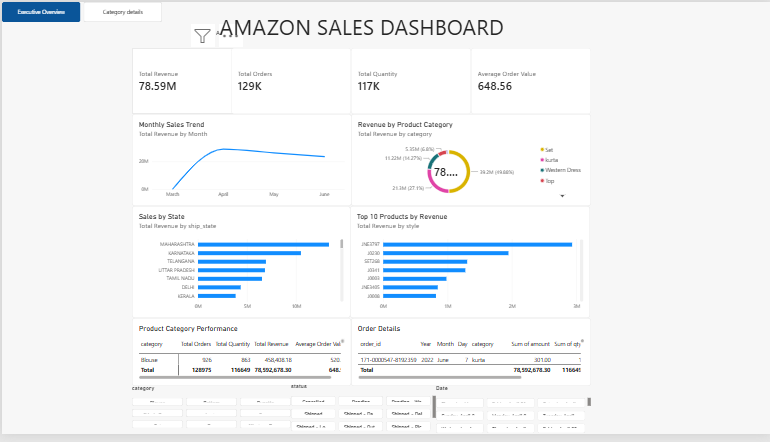

# Amazon Sales Data Analytics

This project analyzes an Amazon sales dataset using Python, SQL,
and Power BI to extract business insights and create interactive
visualizations.

## Tasks Completed

### Task 1 — Data Cleaning & EDA

- Data cleaning and preprocessing
- Missing-value handling
- Duplicate removal
- Data-type correction
- Outlier analysis
- Exploratory data analysis
- Statistical summaries
- Univariate and bivariate analysis

### Task 2 — SQL & Data Extraction

- SQLite database
- 20+ SQL queries
- Aggregation and filtering
- Subqueries and CTEs
- Window functions
- Moving averages
- Cumulative revenue
- Query optimization
- Python-SQL integration using SQLAlchemy

### Task 3 — Data Visualization & Dashboarding

- Matplotlib visualizations
- Seaborn statistical visualizations
- Plotly interactive visualizations
- Power BI executive dashboard
- KPI cards
- Monthly sales trends
- Category analysis
- Geographic analysis
- Top product analysis
- Interactive filters
- Drill-through pages
- Tooltips
- Bookmarks and navigation
- Dashboard branding

## Key Dashboard Metrics

- Total Revenue
- Total Orders
- Total Quantity
- Average Order Value
- Monthly Revenue
- Revenue by Category
- Sales by State
- Top 10 Products


## Dashboard Preview



## Python Visualizations

The project includes 15+ visualizations created using:

- Matplotlib
- Seaborn
- Plotly

## Interactive Plotly Dashboard

[🔗 Open Interactive HTML Dashboard](dashboards/amazon_sales_interactive.html)

## Project Structure

```text
data/
notebooks/
scripts/
sql/
dashboards/
reports/

## Task 4 – Statistical Analysis & Predictive Modeling

Task 4 focused on applying statistical analysis, time-series
techniques, and machine-learning models to the Amazon Sales dataset.

### Analysis Performed

- Descriptive statistical analysis
- Hypothesis testing using t-test, chi-square test and ANOVA
- Correlation analysis
- Time-series trend analysis
- Moving-average smoothing
- Stationarity testing using the ADF test
- Regression modeling
- Order-status classification
- Decision Tree modeling
- Model evaluation using appropriate performance metrics
- Feature importance analysis

### Important Dataset Limitations

The dataset contains only four months of monthly observations,
which limits reliable long-term time-series forecasting and
seasonality analysis.

The dataset also does not contain a unique customer identifier.
Therefore, customer-level churn, retention and customer
segmentation cannot be reliably performed from this dataset alone.

Classification was therefore performed using order delivery status
rather than customer churn.

# 📊 ApexPlanet Data Analytics Project

## Overview

This project was completed as part of the **ApexPlanet Software Pvt. Ltd. Data Analytics Internship**.

The project focuses on analyzing an Amazon Sales dataset and transforming raw transactional data into meaningful business insights using Python, SQL, Power BI, statistics, and machine learning.

The project covers the complete data analytics workflow:

**Data Cleaning → EDA → SQL Analysis → Visualization → Statistical Analysis → Predictive Modeling → Dashboard → Automation**

---

## 🎯 Objective

The main objective of this project is to analyze Amazon sales data to:

- Understand sales and order patterns
- Identify high-performing product categories
- Analyze monthly revenue trends
- Examine order-status distributions
- Identify potential outliers and anomalies
- Compare geographical sales performance
- Perform statistical analysis
- Build basic predictive models
- Create an interactive business dashboard
- Automate recurring analytics tasks

---

# 📂 Dataset Description

The project uses an **Amazon Sales transactional dataset**.

Important fields include:

| Column | Description |
|---|---|
| `order_id` | Unique order identifier |
| `date` | Order date |
| `category` | Product category |
| `qty` | Quantity ordered |
| `amount` | Order amount/revenue |
| `status` | Order fulfilment status |
| `fulfilment` | Fulfilment method |
| `ship_state` | Shipping state |

### Dataset Limitation

The dataset does not contain a reliable unique customer identifier. Therefore, customer-level churn, retention, and customer segmentation cannot be reliably calculated from the available data.

The dataset also contains only a limited historical period, which restricts long-term seasonal forecasting.

---

# ❓ Key Questions Answered

The project addresses questions such as:

1. What are the overall sales and order volumes?
2. How does revenue change over time?
3. Which product categories generate the most revenue?
4. What is the distribution of order quantities?
5. Which order statuses occur most frequently?
6. Which shipping states generate higher revenue?
7. What relationships exist between numerical variables?
8. Are there significant differences between product categories?
9. Can order amount be predicted using available features?
10. Can delivered order status be predicted from available order information?

---

# 🛠️ Tech Stack

### Programming & Data Analysis

- Python
- Pandas
- NumPy

### Visualization

- Matplotlib
- Seaborn
- Plotly

### Database & SQL

- SQLite / PostgreSQL
- SQL
- SQLAlchemy

### Business Intelligence

- Microsoft Power BI

### Statistics & Machine Learning

- SciPy
- Statsmodels
- Scikit-learn

### Development

- Jupyter Notebook
- VS Code
- Git
- GitHub

---

# 📁 Project Structure

```text
apexplanet-data-analytics/
│
├── data/
│   ├── raw/
│   │   └── Amazon_Sales.csv
│   │
│   └── processed/
│       └── cleaned_amazon_sales.csv
│
├── notebooks/
│   ├── Task_1_EDA.ipynb
│   ├── Task_2_SQL.ipynb
│   ├── Task_3_Visualization.ipynb
│   └── Task_4_Statistical_Modeling.ipynb
│
├── scripts/
│   ├── db_utils.py
│   └── analytics_pipeline.py
│
├── outputs/
│   ├── kpi_summary.csv
│   ├── category_performance.csv
│   ├── monthly_sales.csv
│   └── analytics_results.xlsx
│
├── dashboards/
│   └── Amazon_Sales_Dashboard.pbix
│
├── reports/
│   └── Executive_Report.pdf
│
├── requirements.txt
└── README.md